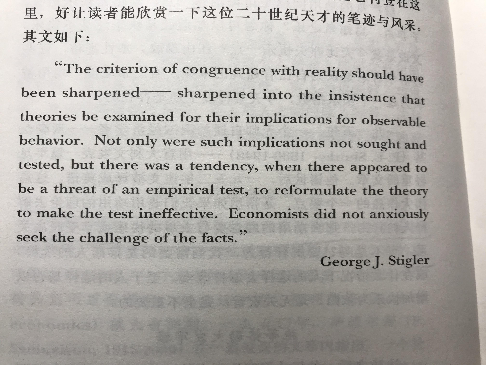

# Book Name: 经济解释-科学说需求
张五常；中信出版社；2020/05/22

### 科学的方法
* 现象必有规律，事实不能解释事实，特殊理论与套套逻辑，可能被事实推翻的重要性，模糊不清与相互矛盾，非事实与无限制，理论的真实性，经济科学的方法  
凡是现象或行为，其存在是靠主观的判断，而大家不能在这主观上有分歧；所有被众所认同的现象，都是有迹可循，有规律的；从事科学研究的人，一定要坚信任何事情是不会无缘无故发生的，推测与解释是一回事：由于某种缘故，某种现象会产生，那么这种现象的产生就算是被解释了  
事实的规律只可以使我们知其然，不能使得我们知其所以然  
事实不能以事实解释  
特殊理论也是理论，不过因为过于特殊，内容太多，以至于内容稍微一改，理论就被推翻了  
一般化的离谱，在任何情况下都不能错的理论，就是套套逻辑：以“争取个人利益最大化”来解释抽烟和跳楼，不可能错，因为假设的本身是包括了人的所有行为  
不可能有第二个问题的答案，或者答案不可能是错的问题，就是愚蠢的问题：MV=PQ是套套逻辑，但是非常精彩，能说明问题，提供看世界的角度  
科学求得是可能被事实推翻。可能被事实推翻但是没有被推翻，就算是被证实了  
否决前事得错误：A得发生含义着B得发生，A得不发生完全不含义着B怎样  
模糊不清的思想，是永远不能被证明错的：“剩余价值”的概念  
在科学方法上，附加的情况较验证条件，经济学称为局限条件：一个限制是必须的  
均衡并不实际存在，无法观察：不均衡是因为被推断的现象没有限制，理论因而缺少了可能被事实推翻的含义，而均衡指的是因为有限制而达到可验证的理论；均衡意思是有足够的约束，找到可以被推翻的假说，不是说一些可以观察到的均衡点  
有实用性的理论是有真实性的  
可以接受的虚构：理论本身必然有抽象的部分；所有事实或观察的描述，一定要简化；简化的目的只是为了便于处理，取消这简化不会影响效果，无关宏旨，所以是允许的：无论怎样简化，一定与世界的真实情况相吻合  

### 自私的武断假设  
* 从斯密到达尔文到道金斯，经济解释的选择，经济学的起点，理论要约束行为
分工产出的程度是被市场的广阔度决定的  
整本《国富论》都含蓄的应用适者生存的思维  
如果我们把自私看为适者生存的后果，人类是不会毁灭自己的；但如果自私是天性使然，那么人是有可能毁灭自己的  
引用交易或者社会费用来揭示人类相互残杀的悲剧，可以验证，用不着推到无从验证的博弈理论那边去  
自私应当作为一个武断的假设，所谓武断，就是起步的基础上大家不要争论  
经济学第一个基础假设是个人是所有经济分析的基本单位：所有取舍都是由个人做出，集体的取舍，是由个人取舍集合而成  
经济学的第一个公理是任何人的行为，都是基于个人做出可以被推测的选择  
自私：每个人在有局限的情况下会为了自己争取最大的利益  
困难的存在，不是自私这个假设是对还是错，而是要指出在不同的局限条件下，图私利会导致欺骗和捐款这两种不同行为的并存  

### 缺乏与竞争
* 物品的定义，什么是缺乏，竞争的本质，游戏规则与产权制度，竞争准则的含义，经济分析与价值观，经济学的范畴  
“有胜于无”是经济学上的“物品”的定义  
物品没有需求，天下就不会有“有胜于无”这回事；而若非供应有限，多胜于少就谈不上  
不愿意付出任何一点代价来争取多一点，不能算是多胜于少  
经济学上的竞争是人与人之间的竞争——所有经济学的基础假设都是为人而设，要解释的行为大都是人和人之间的竞争行为  
没有竞争这句话从比较严格的经济学看，是难以成立的：垄断，专利只不过是压制了某一种竞争，但增加了另一种竞争  
产权制度是竞争游戏规则，也就是约束竞争行为的一种局限条件  
“产”“竞争”“缺乏”是三位一体的  
价格是一个决定胜负的准则，而私有产权是决定这准则的游戏规则  
游戏规则与决定胜负的准则有直接的连带关系：前者决定后者，而后者决定社会的经济运作。实际上，准则在先而游戏规则在后，规则只不过是协助准则的成立而已  
浪费指的是有其他方法或其他资源使用的分配，可使社会财富或者收入增加，但是这些“其他”办法却莫名其妙的不被采用  
价高者得是唯一促使人们来增加生产来换取所需得准则。多尽一份力以生产赚钱，取胜得机会较大，而这生产对社会是有贡献的  
究竟准则是好是坏，或对社会福利有甚好处，则是伦理或价值观的事情了：然而，我没有说增加生产是好的，浪费是坏的  
经济学的范畴：在知道有关的局限条件或游戏规则的情况下，我们可以推断所用的竞争准则是什么；有了竞争的准则，经济学可以推断人的行为是怎样的，资源的使用会怎样，财富或收入分配会怎样；解释游戏规则是怎样形成的  

### 功用的理念  
* 悲哀的发展，功用是数字的定名，费雪的贡献，替换定理与等优曲线，内凸定理，贫穷物品与吉芬反论，功用理念不用为上  
功用：代表快乐或享受的指数；每个人都争取这指数越高越好；一个人的收入增加，其收入在边际上的功用会减小  
如果我们要用功用的理论去解释人的行为，那么功用的理念就要和主关的快乐与享受脱离关系：我们只需要推断人的选择，是否选择是以增加快乐为依归，无关紧要  
功用只不过是经济学者想象出来的概念，要推出可以被事实验证的含义不仅困难，而且陷阱太多，以至于推出来的很容易是套套逻辑，自欺欺人  
可取的功用：不代表快乐，不代表享受，也不代表福利，功用代表的是选择的排列，数字大小是不重要的，重要的是次序  
在边际上，基数序列和序数序列没什么不同，而解释行为单看边际就足够了：变动是边际，而假若没有变动，行为是不能被解释的  
替换定理补加了约束，而增加了解释行为的范畴：每一个人都愿意牺牲任何物品来换取其他任何物品，只要你牺牲的够少，而换的够多，你就愿意   
逻辑上，任何物品都可以是贫穷物品，而是或不是，每个人的选择不同  
用以上的三个定理（功用，替换，内凸）是无法得到“假若要获取的某经济物品的代价减少了，一个人对于该物品的需求量是否增加”的答案。假设增加，那是停留在同一等优曲线上；若非，则不是  
吉芬物品是贫穷物品推到极端，但我们可以从逻辑上否决吉芬物品的存在：吉芬物品的存在是因为我们但从个人需求方面看，忽略了人与人间的竞争，逻辑上吉芬物品不会有成交价格，也就不可能在市场成交；所有消费品都是生产要素，即使是吉芬物品也必然会受到边际产量下降定律的约束  

### 需求定理
* 观察与验证，弗里德曼的分析，不变量的选择，品味不变的假设，用值与换值得理念，何为价？何为量？消费者盈余，需求得价格弹性，需求第二定理不能成立  
只要接受需求定律，等优曲线的分析是多余的：需求曲线是经济学的灵魂，唯一不可或缺的理论或者工具  
在一个没有失业的社会中，某物品的价格下降不会导致人民的实质收入上升。因为价格的转变只会导致资源使用的转移，不会导致社会的收入增加：功用分析中的吉芬反论，只不过是局部均衡的结果  
需求定律需要有准则地选变与不变的因素：凡是直接影响供应的其他因素皆可变，凡是直接影响需求的其他因素皆不可变  
一个人行为改变了，就说因为这个人品味有所转变  
我不是说品味真的不会变，而是说品味的转变来解释行为，不可能推出可以被事实验证的含义  
用值是某物给予拥有者或者享受者的最高所值，或者这个人愿意付出的最高代价。换值是获取该物品所需要付出的代价  
市价就是代价，但是代价不一定是市价：价值与成本是一枚硬币的两面  
价格永远是相对价格；价格通常用现值来量度，价格或代价有动态，有流动与静止之分  
如果工资以时间算，时间只是一个委托量，本身不代表工人操作的共享，不一定有所值  
某产品以一个委托量算价，也同时以几个有质的量算价  
由于维生素瓶子是直接的委托量，消费者只能追寻边际上一瓶的最高用值和一瓶的价格相等，每种维生素的边际用值是不可能与他们的价格相等的  
履行定律说的是被选择量度了而作价的量，其监管出售者履行的费用会下降  
消费者盈余是用值和换值得差额  
全部或零“all or nothing”适用于在无法精细价格分歧得时候，榨取消费者盈余，全部或零是最高用值的平均价  
需求第二定律：弹性系数的大小与时间是正相关的，若某物减了价或者加了价，价变后的时间越长，弹性系数越高；时间越长，替换的机会越大，所以正相关。他对的一半是找寻替代物品需要时间；他忘记的是替代物品有时众所周知，不需要找寻：价格上升——立即转换——不甚合意——回归原始  

### 小试牛刀
* 无知的含义，验证的条件，不管成交量的含义，单质的需求验证，多质的需求验证，成衣配额的分析示范  
一般认为市价较高的质量应该较好，因为市场已经做了鉴别  
解释香港人吃到上佳的华盛顿红苹果，阿尔钦（华盛顿上佳：一般=2：1，香港多邮费1块，上佳：一般=3：2，上佳在香港便宜一些，需求就多，卖的好）存在误区，正确的角度是因为有固定的运费，糖分和其他质量上升时，这些质的间接之价在香港跌的很快。（1糖分单位5c，上佳3 unit=15c, 中等2unit=10c,邮费10c固定，上佳一糖分单位8.33c,普通一糖分单位10c，所以上佳多运往香港）  
配额是值钱之物，一件成衣要一个配额才可出口，制造商怎会不增加其质量？  
配额的自由转让不仅使得配额落于善用或适用者的手上，也使得配额的价值上升，而使得香港优质成衣的相对价格下降的更多了  
配额引进之后，成衣制造商之间的竞争受到约束，使得配额的每个受配者在某种程度上拥有一点垄断权，配额之价代表着垄断租值，这租值的存在容许持有配额的竞争者提升成本，因而容许成衣质量的大幅提升   
成衣质量大幅提升：需求定律强迫质量上升的选择；配额租值给予成本上升的空间  

### 交易理论与市场需求
交易是否上下交征利，市场需求否决剪刀分析，交易的局限条件，自私三解与市场应对   
帕累托最优：资源的使用及物品的交易可以达到一个情况或者条件，满足了这条件，我们不可能改变资源的使用，使得一个人得益而其他人不受损  
原则上，一个人的需求曲线可以某部分向右上升，另一部分向右下倾斜，然而，凡有交易，必定是在向右下倾斜的那部分发生  
如果有交易费用的存在，上述的市价等于每个需求者的边际用值得均衡情况不一定能达到  
如果市价和任何需求者得边际用值有差距，那么为了增加个人利益，市场交易会增加或者减少，市价也会变动，从而使市价与每个人得边际用值相等  
市价得厘定，绝不是因为市场需求和市场供给曲线相交。正相反，这市场二线相交，是因为数之不尽的需求者与供应者各自为战，那一大群自私自利的人，不约而同的争取自己的边际用值与市价相等，从而促成市场需求曲线与市场供应曲线相交之价  
如果价格被管制在市价之下，需求的一群见到自己的边际用值高于价格，竞争抢获不得，逼着要付出金钱价格以外得其他代价来做补充而争取，我们于是会有另一种均衡，不会有短缺，而竞争就被解决了。价格管制的分析困难，不是因为不均衡，而是我们不知道哪一种金钱之外的准则会被采用   
市场本身是一种制度，而制度是因为有交易费用的存在而产生的。假设交易费用是0，又怎么会有市场呢？采用市价的准则是有清楚的权利界定  

### 共用品与隔离理论 
共用品的性质，大师之见有问好，横看成岭侧成峰，赏罚不对称的隔离理论  
共用是指多人可以共享而不干扰他人的享用，私用品的性质是独用，共用品的性质是同用，私用品可以共有（公厕），共用品可以私有  
共用品有相互矛盾的两种看法，一种是要采用价格分歧，收到尽，才可以达到帕累托最优；其二是多供应一个享用者的边际费用/成本是0，应该一律不收费  
产量上升而平均成本不断下降的行业，某方面往往有共用品的性质  
把共用品绑着私用品一起销售，是隔离不付费的人不能享用的好办法，可以减低交易费用（来听音乐的人必须付座位的钱）  
凡是享用人数增加而物品的量不增加，属于共用品，市场的需求曲线是个别享用者的需求边际用值向上直加而成  
共用品因为受影响的人多，可以无数，产出这共用品的人不收费对自己往往有好处。私用品例如一个苹果，一个人独自吃了，没有其他收益，不像美人打扮，因为有外人欣赏而得到一点回报  

### 经济学的理论结构和哲学性质
* 经济学的理论结构，经济学的哲学性质  
市价作为竞争准则如果被禁止采用，其他竞争准则会出现，局部或者全部替代市价  
扩展到市场有无数的参与者，所有人的边际用值等于所有人的边际成本，在一律等于市场的成交价  
投资与储蓄是一回事，只是角度不同  
经济学的理论结构由三部分组成：需求的定律，成本的概念，竞争的局限  
经济学频频涉及哲学逻辑的科学方法的原因：经济学要解释的是人类的行为，就是经济学者要解释自己，这使得不少经济学者喜欢把自己的价值观带到自己认为是理想的世界，不容易置身事外看问题；作为一门实证科学，经济学的实验室是真实的世界，没有自然科学必有得人造的实验或者化验室的支持，协助着假说或理论的验证  
经济学的公理或定律是从人类行为反推过来成立的，有多而复杂的变化，以炮制情况来做实验，充其量只能验证一些没有什么变化的行为   
经济学的公理不是事实，而是从人类的行为，经过竞争和自然淘汰的左右，反推出来而求得

